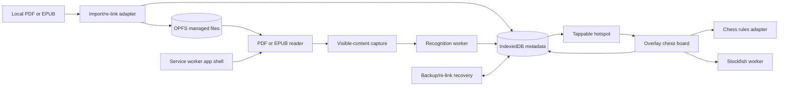

# Chess Reader architecture

Status: proposed web-first architecture
Last updated: 2026-09-03

## 1. Product definition

Chess Reader is a local-first progressive web application for DRM-free PDF and
EPUB chess books. It runs in laptop browsers and Safari on iPad and is packaged
unchanged inside a thin Capacitor Android wrapper. The reader remains usable
while a movable analysis board floats above it.

For visible content, the application finds chess diagrams on the user's device,
projects tappable hotspots over them, and caches the result. Tapping a hotspot
loads the recognized position into an editable board. The user can correct the
position, choose FEN state that an image cannot prove, explore legal variations,
and later run local Stockfish analysis.

There is no whole-book scan in the initial product:

1. Open or navigate a book normally.
2. After the viewport settles, check the recognition cache.
3. If needed, render only visible/current content and recognize it in a worker.
4. Project each detected rectangle back into reader coordinates.
5. Make each rectangle tappable and persist the result.
6. If automatic detection fails, let the user select a rectangular region.

## 2. Architecture principles

- **One product, one UI:** the PWA is the primary application. Android adds
  native file/lifecycle affordances only when the browser contract is
  insufficient.
- **Local-first, not cache-only:** app state has an authoritative local store,
  explicit durability status, re-linking, and backup/restore.
- **Capability-driven:** feature availability follows runtime probes, not user
  agent strings. Multi-threaded Stockfish and persistent file handles degrade
  to supported alternatives.
- **Adapters around volatile dependencies:** PDF, EPUB, recognition, storage,
  chess rules, and Stockfish are independently replaceable.
- **Workers for heavy work:** PDF rendering where possible, recognition,
  hashing, imports, and Stockfish must not block the UI thread.
- **Tests are product contracts:** compatibility, accuracy, coordinate
  alignment, persistence, and recovery are executable gates.

## 3. System context



No book content, recognition input, position, or engine request leaves the
device. The deployed origin is needed to install/update the application, but a
verified installed copy works offline.

## 4. Target platforms

The supported baseline is:

- current and previous stable Chromium desktop;
- current and previous stable Firefox desktop;
- current and previous stable Safari on macOS;
- iPadOS 17+ Safari and installed Home Screen web app;
- Android 12+ through current Chrome and the Capacitor wrapper.

Automated WebKit emulation is useful but does not replace a real iPad gate.
Private/incognito browsing is an explicitly unsupported durability mode; the
application should warn and remain usable for the current session.

## 5. Technology stack

### Application

- TypeScript in strict mode
- React with a Vite-built PWA
- pnpm workspaces and a committed lockfile
- standards-first responsive CSS with pointer and keyboard support
- service worker with an explicit, testable update protocol
- Vitest for unit/contract tests and Playwright for browser integration/E2E

Dependency versions are pinned at bootstrap. Production dependencies never use
floating tags.

### Repository layout

```text
apps/web                 PWA shell, routes, responsive UI, service worker
apps/android             added later: Capacitor wrapper and native adapters
packages/core            identifiers, locators, FEN/move/session models
packages/storage         IndexedDB, OPFS, import, backup, migrations
packages/reader          ReaderSurface contract and shared coordination
packages/reader-pdf      PDF.js adapter
packages/reader-epub     selected EPUB adapter
packages/recognition     fenshot/ONNX Runtime Web worker
packages/chess           ChessRules adapter
packages/engine          Stockfish worker and UCI parser
packages/test-fixtures   generated/licensed PDF, EPUB, image, FEN fixtures
```

Do not create all packages merely to fill the tree. Each issue introduces its
package when its independent contract or heavy dependency becomes real.

## 6. Reader architecture

### Shared contract

`ReaderSurface` exposes format-native locators, viewport changes, coordinate
projection, bounded recognizable input, table of contents, preferences, and
cleanup. A PDF page number is never used as a fake EPUB locator.

```text
ReaderSurface
  currentLocator()
  goTo(locator)
  observeViewport()
  project(sourceRect)
  captureVisibleContent(limit)
  tableOfContents()
  dispose()
```

### PDF

Use Mozilla PDF.js behind `PdfJsReaderAdapter`. PDF.js supplies canvas rendering,
page viewports, and transformations that map normalized PDF rectangles to the
displayed page. Rendering and capture are bounded, but by different measures,
because they answer different questions:

- **Capture** bounds the _long edge_ (currently 1024 px, `MAX_CAPTURE_LONG_EDGE_PX`),
  because the recognizer's input size is what matters there.
- **Display** bounds the _total device-pixel area_ (currently 8 MP,
  `MAX_RENDER_DEVICE_PIXELS`), because what matters there is the canvas
  allocation. A long-edge cap bounds only one axis and so does not bound the
  allocation at all; it also capped ordinary pages on high-DPI screens, forcing
  a downscale-then-upscale that visibly blurred text. The page is rasterised
  once at exactly the device resolution it will be shown at, and the on-screen
  canvas's backing-store-to-CSS ratio is kept exactly equal to
  `devicePixelRatio`, so nothing resamples the page after pdf.js draws it.

The display budget's binding constraint is iPad Safari's undocumented canvas
ceiling, not desktop memory; see `MAX_RENDER_DEVICE_PIXELS` in
`apps/web/src/reader/PdfReader.tsx` for the arithmetic and the unrun
physical-iPad gate that would be needed to raise it.

pdf.js decodes JBIG2 and JPEG 2000 images in WebAssembly that it fetches at
runtime. Those binaries are self-hosted from the pinned package with fail-closed
hash verification; leaving them unconfigured makes affected images silently
render as blank space. Standard fonts and CMaps are deliberately _not_ shipped
(see `apps/web/src/reader/NOTICE.md` for the licensing and security reasons);
that is a reader-quality decision belonging to the reader issue.

Store zero-based page plus normalized page coordinates. Reproject hotspots
after zoom, scroll, rotation, responsive layout, or analysis-panel resizing.
Release canvases and image bitmaps promptly; an unbounded rendered-page cache is
forbidden.

### EPUB selection spike

The EPUB dependency is deliberately not selected by assertion. An early issue
implements the same local sample with both:

- Readium Web/Thorium Web; and
- EPUB.js.

The scorecard covers local Blob/ArrayBuffer opening without a required server,
offline use, reflowable and fixed-layout rendering, stable locator restore,
visible-image discovery, coordinate mapping, accessibility, iPad memory,
maintenance, and hostile-publication isolation.

Current evidence favors EPUB.js for the local-only product because it directly
accepts an ArrayBuffer. Readium Web's normal design consumes a Readium Web
Publication Manifest, commonly supplied by its Go HTTP toolkit, and its own
maintainers note that arbitrary local-publication opening is not yet a simple
production path. Readium remains in the spike because its navigator and
accessibility model may justify an in-browser manifest adapter.

The winning implementation is hidden behind `EpubReaderAdapter`; the scored ADR
is the deliverable. If neither safely meets the gate, EPUB is held behind an
experimental flag rather than weakening security or offline requirements.

### Untrusted EPUB isolation

EPUB content is active web content and must be treated as untrusted even for a
personal reader. The selected adapter must:

- disable publication scripts by default;
- block forms, popups, top navigation, downloads, and external network loads;
- sanitize markup and dangerous URL schemes before rendering;
- apply a restrictive iframe sandbox and injected Content Security Policy;
- use a versioned, schema-validated `postMessage` bridge if frame communication
  is needed;
- keep application storage inaccessible to publication code; and
- pass the malicious-EPUB evaluation corpus.

The security model must also remain compatible with cross-origin isolation used
by threaded WebAssembly. This interaction is a required spike test.

## 7. Analysis-panel interaction

The book is the base layer. The analysis board is a movable, resizable,
collapsible layer above it.

- Compact screens default to a bottom-anchored panel around half height.
- Larger screens default to a right-side/floating panel.
- Pointer events inside the panel belong to the board; events outside remain
  with the reader.
- A dedicated handle moves/resizes the panel so chess gestures do not move it.
- Opening/closing the panel does not recreate the reader or change its locator.
- Browser safe-area insets, iPad multitasking widths, orientation changes,
  keyboard navigation, and touch targets are tested.

A detected diagram is a single-tap target. A subtle affordance marks readiness
without covering the printed position. Cached candidates are immediately
tappable; uncached work always exposes progress and cancellation.

## 8. Offline recognition

Use the MIT-licensed `scoriiu/fenshot` package rather than porting it to Kotlin.
It combines page-level board detection, a roughly 1.3 MB ONNX tile classifier
trained on book styles, orientation resolution, and per-square confidence.

Run recognition through ONNX Runtime Web in a dedicated worker. WebAssembly is
the baseline because ONNX Runtime documents it across Chromium, Firefox, and
Safari/iOS. WebGPU is an optional measured acceleration and never a requirement.
Self-host and version the ONNX model and runtime assets.

```ts
interface DiagramRecognizer {
  readonly version: string;
  recognize(input: RecognitionInput, signal: AbortSignal): Promise<readonly DiagramCandidate[]>;
}
```

Each candidate contains a normalized rectangle, piece placement, proposed
orientation, aggregate confidence, and 64 square confidences. Image recognition
does not invent side-to-move, castling, en-passant, or move counters.

The coordinator debounces stable viewports, checks cache first, allows only one
active inference per client, cancels obsolete work, and rejects late results by
content key. User corrections always win over model updates.

## 9. Chess model and position editing

Put FEN validation, legal move generation, SAN, undo/redo, and PGN boundaries
behind `ChessRules`. Evaluate a maintained, permissively licensed TypeScript
library using perft and special-move contract tests before choosing it.

The editor supports pieces, empty squares, orientation, side to move, castling,
en-passant, and move counters. It accepts legal study positions that need not be
reachable from the starting position while rejecting internally inconsistent
state.

Persist an immutable initial full FEN and parent-linked UCI move nodes. The
first move issue enforces one child per node; the variation issue later permits
multiple ordered children. SAN is derived presentation, not authoritative data.

## 10. Stockfish in browsers and on iPad

Run a pinned Stockfish WebAssembly build in a dedicated Web Worker behind
`AnalysisEngine`. Keep UCI parsing shared and engine-variant details internal.

Ship and test two capability paths:

1. a portable single-thread WebAssembly build that needs no shared memory; and
2. a threaded SIMD build used only when `crossOriginIsolated`,
   `SharedArrayBuffer`, WebAssembly thread probes, and a worker self-test pass.

The hosting configuration sends `Cross-Origin-Opener-Policy: same-origin` and
`Cross-Origin-Embedder-Policy: require-corp`; all application, worker, WASM,
model, font, and engine assets are self-hosted with compatible policies. Startup
tests fail if production headers do not actually yield the expected capability.

iPad uses conservative defaults even when threads work: one thread, small NNUE,
modest hash, and MultiPV 1. The UI exposes threads only when the runtime supports
them and caps them below reported logical processors. Engine activity stops on
explicit stop, panel close according to preference, `visibilitychange`,
`pagehide`, worker failure, or a watchdog timeout. The session can be rebuilt
from FEN plus UCI path after Safari suspends or terminates the page.

The service worker caches the selected engine/NNUE assets by content hash. An
offline-readiness check proves that the exact configured variant is locally
available before promising offline analysis.

## 11. Durable local storage

Storage behavior is detailed in `docs/platform-limitations.md`.

Use distinct stores for distinct jobs:

- Cache Storage: versioned application shell, workers, WASM, model, and NNUE;
- IndexedDB: structured metadata, settings, locators, recognition records,
  corrections, analysis sessions, and move nodes;
- Origin Private File System (OPFS): optional managed copies of PDF/EPUB bytes;
- transient `File`/file handles: user-selected source documents.

### Import modes

`Managed copy` is the recommended iPad mode. After a user gesture, request
persistent storage, inspect `navigator.storage.estimate()`, verify headroom,
stream the file into an OPFS staging location, calculate a chunked SHA-256, and
atomically publish the metadata only after the copy succeeds.

`Reference/re-link` keeps no durable book bytes. It remembers content identity
and app data; when the browser cannot retain an external handle (notably Safari),
the user selects the original again. A matching content hash reconnects all
locators, corrections, and analysis automatically.

Chromium may retain a File System Access handle when supported, but that is an
optimization. The standard file input and re-link flow is always available.

### Failure and recovery

- Handle `QuotaExceededError`, denied persistence, missing OPFS entries,
  partial imports, database migration failure, and cleared site data explicitly.
- Use a two-phase import journal because IndexedDB and OPFS cannot share one
  atomic transaction.
- Check managed-file existence on open and offer re-link/repair.
- Offer a versioned backup export for metadata, corrections, and move trees;
  recognition caches are optional and book bytes are excluded by default.
- Restore into a staging database, validate schema/checksums/references, then
  swap; a failed restore leaves existing data intact.
- Display storage mode, persistence grant, usage/quota estimate, offline asset
  readiness, and last successful backup in a storage-health screen.

No browser API can protect data after the user clears website data. The product
solution is visible durability state plus backup and content-hash re-linking,
not a false promise.

## 12. Data model

`books`

- UUID, content SHA-256, format, title/author
- storage mode and OPFS path or optional retained handle reference
- byte size, availability status, import journal id
- last format-native locator and timestamps

`diagrams`

- book id and stable PDF page or EPUB resource/anchor locator
- source fingerprint and normalized rectangle
- recognized placement/orientation/confidence/per-square confidences
- recognizer/model version
- corrected full FEN and correction flag

`analysis_sessions`

- diagram id, immutable initial full FEN, current node id
- panel state and timestamps

`move_nodes`

- session id, nullable parent id, UCI move, sibling order
- future-compatible comment/NAG fields

Book identity uses bytes, not filename. A model upgrade may invalidate only
uncorrected recognition rows. Re-linking identical bytes never loses study data.

## 13. Service-worker update protocol

- Generate a build manifest containing hashes for the shell, workers, PDF.js,
  recognition model/runtime, Stockfish variants, and NNUE.
- Download into a versioned cache and verify every required response before
  marking the version ready.
- Never delete the active cache until the replacement is complete.
- Do not force-reload while a book has unsaved state; show an update prompt.
- Keep one rollback-compatible previous asset set when quota allows.
- Run an offline boot and engine/recognizer asset self-check in release CI.

## 14. Android wrapper

Capacitor packages the production web build for Android 12+. The wrapper may
provide native file picking, durable app-private book copies, back handling,
safe-area/status-bar integration, and APK signing. Domain, reader, recognition,
board, persistence schema, and engine UI remain web code.

Native adapters implement the same capability interfaces as browsers. They do
not become a second product fork. Any Android-only behavior requires a contract
test and a documented reason.

## 15. Privacy and security

- No analytics, accounts, upload endpoint, or required application API.
- Production Content Security Policy permits only self-hosted app assets and
  controlled blob workers/resources.
- No third-party CDN is used at runtime.
- Imported files are validated by content and size limits, not only extension.
- EPUB active content and network requests are blocked.
- Release logs exclude book text/images, full file names/paths, FENs, and URIs.
- Backups are local downloads; if optional encryption is later added, it needs a
  separate reviewed design.

## 16. Delivery strategy

Implementation uses a walking skeleton followed by alternating product slices
and focused hardening:

1. Deploy the responsive PWA shell and browser test loop.
2. Cross PDF rendering, manual capture, fenshot, and a basic editable overlay in
   one deliberately narrow in-memory slice.
3. Make that exact path installable, offline, restorable, and test it on a real
   iPad before generalizing the storage and reader layers.
4. Harden storage, PDF reading, and recognition, then add automatic PDF taps,
   the full editor, and one legal line.
5. Evaluate Readium Web and EPUB.js through the already-working study workflow,
   then add production EPUB reading and automatic EPUB taps.
6. Add branches, a portable one-PV Stockfish slice, and only then configurable
   MultiPV/threaded engine variants.
7. Harden updates, storage recovery, accessibility, performance, security, and
   licensing against the complete web product.
8. Package that qualified web build in Capacitor and perform cross-platform
   release qualification.

The early slice may use narrow concrete code where a generalized contract would
be speculative. Stable adapters are extracted as the second implementation or
failure mode makes the boundary real. Conversely, import journaling, the EPUB
renderer comparison, security, and recovery remain focused tasks where forcing
a user-facing slice would hide rather than reduce their risk.

The ordered GitHub issues and checkpoint table in `docs/issue-plan.md` implement
this strategy. A vertical-slice issue must preserve its complete path; a focused
infrastructure issue must prove itself through the nearest existing path. Every
experimental result updates the relevant ADR and evaluation baseline.

## 17. Out of scope

- DjVu and DRM circumvention
- whole-book recognition
- cloud accounts, sync, remote library, or server recognition
- automatic parsing of surrounding move text
- game/video database search
- Play Store or App Store publication
- relying on private/incognito storage

## 18. Primary references

- [PDF.js](https://github.com/mozilla/pdf.js)
- [Readium Web](https://github.com/readium/web)
- [Thorium Web](https://github.com/edrlab/thorium-web)
- [EPUB.js](https://github.com/futurepress/epub.js)
- [fenshot](https://github.com/scoriiu/fenshot)
- [ONNX Runtime Web](https://onnxruntime.ai/docs/get-started/with-javascript/web.html)
- [Lichess Stockfish Web](https://github.com/lichess-org/stockfish-web)
- [WebKit storage policy](https://webkit.org/blog/14403/updates-to-storage-policy/)
- [WebKit OPFS support](https://webkit.org/blog/12257/the-file-system-access-api-with-origin-private-file-system/)
- [Capacitor](https://capacitorjs.com/docs)
