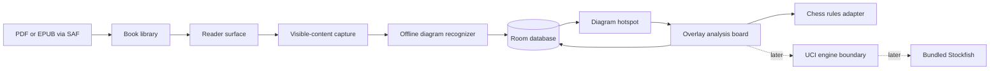

# Chess Reader architecture

Status: proposed architecture for the first usable product  
Last updated: 2026-09-03

## 1. Product definition

Chess Reader is a local-first Android reader for DRM-free PDF and EPUB chess
books. The reader remains usable while an analysis board floats above it.
When the current page or EPUB viewport contains a chess diagram, the app finds
the diagram on-device and creates a tappable hotspot. Tapping it loads the
recognized position into the analysis board. The user can correct the position,
choose missing FEN state, and play legal moves.

The first usable recognition workflow is deliberately page-local:

1. Open or navigate a book normally.
2. After the viewport settles, look for a cached result for the visible page or
   EPUB resource.
3. If none exists, render only the current content and recognize it off the UI
   thread.
4. Project each detected board rectangle back into reader coordinates.
5. Make each rectangle tappable and cache the result.
6. If detection fails, let the user select a rectangular region and run the
   same recognizer on that crop.

There is no whole-book scan in the initial product. This keeps import fast,
memory bounded, battery use predictable, and every intermediate milestone
useful.

## 2. Experience and acceptance goals

### Reader

- Import files with Android's Storage Access Framework without broad storage
  permission.
- Display PDF and EPUB content with zoom/reflow, table of contents when exposed
  by the format, and restoration of the last reading location.
- Keep the underlying reader mounted and navigable while the board is open.
- Recognize only after scrolling, zooming, or EPUB reflow has settled. Cancel
  obsolete work when the user moves elsewhere.

### Diagram interaction

- A detected diagram is a single-tap target; taps elsewhere keep their normal
  reader behavior.
- A subtle chess affordance may mark a ready hotspot without obscuring the
  printed diagram.
- Loading a cached diagram should feel immediate.
- Uncached recognition must never block gestures or rendering. The benchmark
  issue will set a device-tested latency budget; the working target is a warm
  result around one second on a representative Android 12+ phone.
- Low-confidence squares are visible in the editor. No recognition result is
  treated as infallible.

### Analysis board overlay

- The book is the base layer. The analysis panel is a movable, resizable, and
  collapsible layer above it, following the useful mobile behavior of readers
  such as Chessvision.
- Touches inside the panel belong to the board; touches outside it belong to
  the reader. A dedicated drag handle moves/resizes the panel so board moves do
  not accidentally reposition it.
- The default phone layout is a bottom-anchored panel occupying roughly half
  the screen. On larger widths it may default to a right-side floating panel.
- Opening or closing the panel must not reset the book locator.

### Chess position and play

- The recognizer supplies piece placement and a likely orientation. The user
  confirms or changes side to move because it is not reliably present in a
  printed diagram.
- The editor supports piece placement/removal, clear/reset, orientation, side
  to move, castling rights, and en-passant state. Halfmove/fullmove fields may
  default safely and remain available in an advanced section.
- The first move feature stores one legal, undoable/redoable line.
- A later issue enables branches without replacing the persisted model.
- A still later issue adds Stockfish through a replaceable UCI engine boundary.

## 3. System context



Everything inside the solid-line path operates without a network connection.
No book page or position leaves the device. A LAN recognizer can be added behind
the same recognition interface only if the on-device benchmark is unacceptable.

## 4. Technology choices

### Platform

- Kotlin, coroutines, Flow, and Jetpack Compose
- A single-activity application with Navigation Compose
- Minimum SDK 31 (Android 12)
- Version catalog and Kotlin DSL Gradle files
- Hilt for composition only if the bootstrap issue confirms its cost is useful;
  otherwise use a small explicit application container
- Room for structured local state and DataStore for small user preferences

Dependency versions must be pinned by the bootstrap issue after a build against
the then-current Android toolchain. Architecture documents intentionally avoid
`latest.release` declarations.

### EPUB: Readium Kotlin

Readium Kotlin is the EPUB publication and navigation layer. Its chromeless
Navigator fragments allow the app to own the surrounding UI, it exposes
locators for restoration, and it supports JavaScript/native integration needed
to identify visible image elements.

For EPUB recognition, prefer original image resources over screenshots:

1. Inject a small, versioned script into the navigator to report visible image
   elements, stable DOM identifiers, and viewport rectangles.
2. Resolve the corresponding publication resource through Readium.
3. Recognize the original image off-thread.
4. Project the DOM rectangle to the Android overlay.

For SVG, CSS-rendered, or otherwise non-image diagrams, fall back to a rendered
viewport capture and, if needed, manual region selection. Cache EPUB results by
book hash plus resource href/DOM anchor and image hash, not by screen pixels;
font size and orientation must not invalidate the recognized position.

### PDF: AndroidX PDF

Use AndroidX PDF rather than Readium's Pdfium adapter. The Readium adapter is
built on an upstream it describes as unmaintained. AndroidX PDF now provides:

- page bitmap sources suitable for recognition;
- PDF-coordinate rectangles and point conversion;
- visible-page and zoom callbacks; and
- a Compose-facing viewer.

Keep this behind `PdfReaderAdapter`, because the AndroidX API is still evolving.
A PDF diagram rectangle is stored in normalized page coordinates and transformed
to view coordinates whenever the viewport changes. The recognizer should render
a page to a bounded long edge (initially 1600-2000 px, tuned by benchmark), not
recognize an arbitrarily large zoomed screen bitmap.

### Recognition: fenshot-derived native pipeline

The primary candidate is the MIT-licensed `scoriiu/fenshot` pipeline. It is a
particularly good fit because it combines classical page-level board detection,
a small 1.3 MB ONNX square classifier trained on book styles, orientation
resolution, and per-square confidence.

The app will not embed a JavaScript/WebView runtime just to recognize diagrams.
Instead, the recognition spike will:

- port the deterministic board-detection and preprocessing code to Kotlin;
- run the supplied model with ONNX Runtime Android;
- validate Kotlin tensors and results against upstream golden fixtures;
- benchmark CPU/XNNPACK first and NNAPI only if useful; and
- record the upstream commit/model checksum and license.

The boundary is:

```kotlin
interface DiagramRecognizer {
    val version: String
    suspend fun recognize(input: RecognitionInput): List<DiagramCandidate>
}
```

`DiagramCandidate` contains a normalized rectangle, piece placement, proposed
orientation, aggregate confidence, and 64 square confidences. Full FEN fields
that an image cannot prove are explicitly supplied by the user/defaults.

The recognizer loads lazily, keeps at most one inference active, reuses its
session, and closes it on application teardown. Recognition failures are values
(`NoBoard`, `LowConfidence`, `Unsupported`, `Internal`) rather than crashes.

The LAN alternative, if ever needed, implements the same interface and is an
optional build/runtime feature. It is not required by any first-release issue.

### Chess rules

Put move generation, legality, SAN, and FEN parsing behind `ChessRules`. Start
with a pinned, permissively licensed JVM chess library after a small contract
test proves it works on Android. The current leading candidate is
`bhlangonijr/chesslib` (Apache-2.0), but the adapter is intentional: upstream
bugs must not leak into UI or persistence contracts.

Contract tests cover perft positions, check, castling, en passant, promotion,
undo/redo, SAN ambiguity, and arbitrary legal FEN starting positions. The app's
persisted move representation is UCI plus the initial full FEN; SAN is derived
for display.

### Stockfish

Stockfish is a separate, later capability behind an asynchronous `AnalysisEngine`
interface. The implementation communicates using UCI and owns exactly one engine
session. It must support cancellation and lifecycle-safe `stop`/shutdown.

Initial settings:

- MultiPV: 1 by default, user configurable
- Threads: 1 by default, capped to a safe device-derived maximum
- Hash: conservative default such as 64 MB, bounded by device memory
- Analysis: infinite until stopped, with optional depth/time limits later

Package reproducible ABI-specific binaries or a native wrapper, include the
GPLv3 license, Stockfish authors, exact source/version, NNUE provenance, build
instructions, and the source pointer required for the distributed binary. An
integration spike must choose the safest Android process/JNI approach before
the feature issue lands.

## 5. Module and package boundaries

Use modules where a native/heavy dependency or independently testable contract
justifies one; avoid a module per screen.

```text
:app                  Compose UI, navigation, application composition
:core:model           Pure Kotlin identifiers, locators, FEN/move/session models
:core:data            Room, DataStore, repositories, file identity
:core:chess           ChessRules contract and library adapter
:reader               ReaderSurface contract, PDF and EPUB adapters
:recognition          Recognition contract, capture coordinator, ONNX implementation
:engine               Added later: AnalysisEngine contract and Stockfish implementation
```

Within `:app`, use feature packages for `library`, `reader`, `board`, and
`settings`. UI talks to use cases/view models, never directly to Room, Readium,
ONNX Runtime, or Stockfish.

Important interfaces:

```text
BookRepository          import/open/delete books and persist locators
ReaderSurface           navigate, expose viewport, capture recognizable content
DiagramRepository       cache and update recognized/corrected diagrams
DiagramRecognizer       bitmap/resource -> diagram candidates
RecognitionCoordinator  debounce/cancel/deduplicate visible-content work
ChessRules              validate/edit/play/undo/format
AnalysisRepository      persist initial FEN, move nodes, and current cursor
AnalysisEngine          later: stream UCI analysis for a position
```

## 6. State and data model

Room is the source of truth for durable app-owned data. Reader widgets and
native sessions are runtime state, reconstructed from persisted locators and
models.

### Core tables

`books`

- `id` UUID
- `content_uri`
- `persisted_permission` flag
- `content_hash` SHA-256, unique with format
- `format` (`PDF`, `EPUB`)
- title/author/cover cache metadata
- `last_locator_json`
- import/open timestamps

If a provider cannot grant durable URI access, import the file into app-private
storage with explicit progress instead of silently depending on a temporary URI.

`diagrams`

- `id`, `book_id`
- stable content locator (`page_index` for PDF; href/anchor for EPUB)
- source image/resource hash
- normalized source rectangle
- recognized piece placement and proposed orientation
- aggregate and per-square confidence
- recognizer version and model checksum
- corrected full FEN and `is_user_corrected`
- created/updated timestamps

User-corrected rows always win over new model output. A model upgrade may mark
uncorrected cache entries stale, but never overwrites corrections.

`analysis_sessions`

- `id`, `diagram_id`
- immutable initial full FEN
- current node id
- panel geometry/collapsed state if scoped to the session
- created/updated timestamps

`move_nodes`

- `id`, `session_id`, nullable `parent_id`
- UCI move, sibling order, optional comment/NAG fields for future use

The single-line issue enforces at most one child per node in its use case. The
later variation issue removes that restriction and adds branch UI; no database
replacement is required.

### Identity and cache invalidation

- Book identity is based on content hash, not display name or URI.
- PDF cache key: book hash + zero-based page + page-content/render fingerprint.
- EPUB cache key: book hash + resource href/DOM anchor + source resource hash.
- Recognition cache key includes recognizer version/model checksum.
- Manual corrections are separately flagged and retained across recognizer
  upgrades.

## 7. Runtime flows

### Import and open

```text
SAF open document
  -> retain URI permission or copy privately
  -> hash stream on Dispatchers.IO
  -> parse metadata
  -> upsert Book
  -> open reader at saved locator
```

### Visible-page recognition

```text
viewport settles
  -> build stable content key
  -> cached diagrams? -> project hotspots immediately
  -> otherwise capture bounded bitmap/resource
  -> recognize on limited worker dispatcher
  -> persist candidates/confidence
  -> project hotspots if viewport is still current
```

Stale tasks are cancelled and their UI result discarded. A completed result may
still be cached if its content key is valid. OOM and corrupted-book failures are
reported without closing the reader.

### Tap and study

```text
tap hotspot
  -> load corrected FEN or recognition proposal
  -> require/confirm side to move when first opened
  -> create/resume AnalysisSession
  -> show panel without recreating ReaderSurface
  -> edit or play legal move
  -> persist move node and cursor transactionally
  -> later: submit the same position/moves to AnalysisEngine
```

## 8. Concurrency, memory, and lifecycle

- Reader rendering owns the foreground priority; recognition and engine work
  may not starve it.
- One recognition inference at a time, with a conflated queue keyed by visible
  content.
- Use bounded bitmaps and release them promptly. Do not retain rendered PDF
  pages in Room or in an unbounded memory cache.
- Keep only small thumbnails/covers in disk cache.
- Stop Stockfish when analysis is disabled and pause it when the app backgrounds;
  restore from FEN and UCI moves rather than serializing native state.
- All long-running work exposes progress/error/cancellation via sealed state.
- Current-page recognition does not use WorkManager; it is user-visible,
  cancellable work tied to the reader lifecycle.

## 9. Security and privacy

- No `INTERNET` permission is needed for the first offline release.
- Use SAF grants rather than all-files access.
- Treat EPUB HTML/JavaScript as untrusted: disable arbitrary network loading,
  expose a minimal JavaScript bridge, validate bridge payloads, and never enable
  filesystem access beyond publication resources.
- Validate MIME type and parser result; do not trust filename extensions.
- Keep engine and recognizer inputs app-local.
- Do not log book text, page images, FENs, or full content URIs in release builds.

## 10. Testing and quality gates

### Unit and contract tests

- normalized rectangle transformations at zoom/rotation/reflow boundaries
- cache identity and migration behavior
- recognition pre/postprocessing golden vectors
- chess perft and special-move behavior
- line/tree persistence and cursor restoration
- UCI parsing, cancellation, and stale-output rejection

### Instrumented tests

- import and reopen through representative SAF providers
- PDF hotspot alignment after zoom, scroll, rotation, and two visible pages
- EPUB hotspot alignment after font/margin/orientation changes
- overlay pointer routing: book navigation works outside the panel
- process death and recreation restore book locator, panel, FEN, and moves
- malformed and large-book failure handling

### Fixture policy

Keep a small, legally redistributable corpus containing:

- digital and scanned PDF pages;
- reflowable and fixed-layout EPUB samples;
- diagrams with coordinates, reversed orientation, hatching, grayscale, and
  low-resolution scans;
- pages with zero, one, and multiple boards.

Every recognition bug should add a minimized, licensable regression fixture or
a synthetic equivalent. Do not commit copyrighted user books.

### Performance gates

The recognition spike establishes baselines on at least one Android 12-class
physical device. Track cold model load, warm page recognition, peak Java/native
memory, APK size, and interaction jank. A LAN fallback is considered only after
model quantization/runtime tuning is measured and recorded.

## 11. Delivery phases

1. Buildable Android shell and quality gates.
2. Library/import plus PDF and EPUB reading with restoration.
3. Stable overlay/coordinate contracts.
4. Offline recognition proof and golden tests.
5. PDF and EPUB diagram hotspots plus fallback selection.
6. Editable board and one-line legal move exploration.
7. Durable sessions and branching variations.
8. Stockfish integration and settings.
9. Device hardening, notices, and reproducible sideloaded APK.

The GitHub issues implement these phases in strict dependency order. Each issue
must leave the app buildable and must not pull later features forward unless the
later issue's contract requires a small seam.

## 12. Out of scope for the planned backlog

- DjVu
- DRM circumvention or proprietary bookstore integration
- whole-book background scanning
- cloud accounts, sync, analytics, or remote storage
- automatic recognition of surrounding move text
- game-database or video-position search
- annotations/bookmarks beyond what the selected reader exposes by default
- Play Store release automation

## 13. Primary references

- [Readium Kotlin toolkit](https://github.com/readium/kotlin-toolkit)
- [Readium PDF adapter limitations](https://github.com/readium/kotlin-toolkit/blob/develop/readium/adapters/pdfium/README.md)
- [AndroidX PDF releases](https://developer.android.com/jetpack/androidx/releases/pdf)
- [AndroidX PDF document API](https://developer.android.com/reference/kotlin/androidx/pdf/PdfDocument)
- [AndroidX PDF viewport API](https://developer.android.com/reference/androidx/pdf/view/PdfView.OnViewportChangedListener)
- [fenshot recognition pipeline](https://github.com/scoriiu/fenshot)
- [ONNX Runtime mobile guidance](https://onnxruntime.ai/docs/tutorials/mobile/)
- [Stockfish source and licensing](https://github.com/official-stockfish/Stockfish)
- [Android Storage Access Framework](https://developer.android.com/guide/topics/providers/document-provider)
- [Room](https://developer.android.com/training/data-storage/room)

