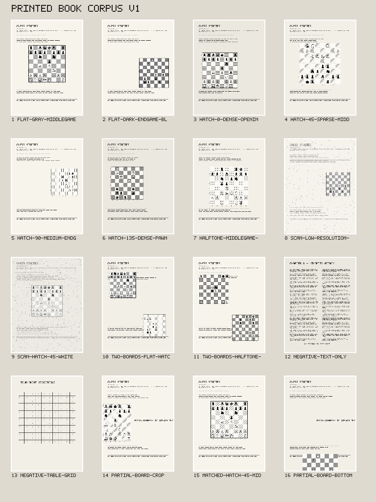

# Printed-book recognition corpus v1

Status: locked before model inference or candidate tuning for issue #34.

All 16 pages are deterministic synthetic 768 x 1024 PNGs. Board rectangles use top-left image pixel coordinates. Complete annotations contain both canonical FEN placement and the placement in rendered image order; partial-board annotations deliberately omit placement truth. The corpus is CC0-1.0 except for rendered Chessnut glyphs, which remain Apache-2.0.

| Page                              | Complete + partial boards | Square treatment                | Orientation      | Coverage tags                                                                                                                                               |
| --------------------------------- | ------------------------: | ------------------------------- | ---------------- | ----------------------------------------------------------------------------------------------------------------------------------------------------------- |
| flat-gray-middlegame-white        |                         1 | flat                            | white            | complete-page, flat, grayscale, middlegame, white-orientation, labels, border                                                                               |
| flat-dark-endgame-black           |                         1 | flat                            | black            | complete-page, flat, grayscale, endgame, black-orientation, labels, border                                                                                  |
| hatch-0-dense-opening-white       |                         1 | hatch 0 dense                   | white            | complete-page, hatch, hatch-0, dense, opening, white-orientation, labels, border                                                                            |
| hatch-45-sparse-middlegame-black  |                         1 | hatch 45 sparse                 | black            | complete-page, hatch, hatch-45, sparse, middlegame, black-orientation, labels, border                                                                       |
| hatch-90-medium-endgame-white     |                         1 | hatch 90 medium                 | white            | complete-page, hatch, hatch-90, medium, endgame, white-orientation, labels, border                                                                          |
| hatch-135-dense-pawnless-black    |                         1 | hatch 135 dense                 | black            | complete-page, hatch, hatch-135, dense, pawnless, black-orientation, labels, border                                                                         |
| halftone-middlegame-white         |                         1 | halftone medium                 | white            | complete-page, halftone, medium, middlegame, white-orientation, labels, no-border                                                                           |
| scan-low-resolution-flat-black    |                         1 | flat                            | black            | complete-page, flat, low-resolution, scan-degraded, speckle, endgame, black-orientation, labels, border                                                     |
| scan-hatch-45-white               |                         1 | hatch 45 medium                 | white            | complete-page, hatch, hatch-45, medium, scan-degraded, low-contrast, speckle, middlegame, white-orientation, labels, border                                 |
| two-boards-flat-hatch             |                         2 | flat ; hatch 90 sparse          | white, black     | complete-page, multiple-boards, flat, hatch, hatch-90, sparse, white-orientation, black-orientation, labels, border                                         |
| two-boards-halftone-ambiguous     |                         2 | halftone dense; hatch 135 dense | ambiguous, white | complete-page, multiple-boards, halftone, hatch, hatch-135, dense, pawnless, ambiguous-orientation, piece-only-ambiguity, white-orientation, labels, border |
| negative-text-only                |                         0 | none                            | N/A              | complete-page, negative, text-only, no-board                                                                                                                |
| negative-table-grid               |                         0 | none                            | N/A              | complete-page, negative, grid, table, no-board                                                                                                              |
| partial-board-crop                |             0 + 1 partial | hatch 45 sparse                 | partial/unknown  | complete-page, partial-board, hatch, hatch-45, sparse, not-complete-truth                                                                                   |
| matched-hatch-45-middlegame-white |                         1 | hatch 45 medium                 | white            | complete-page, matched-style-pair, hatch, hatch-45, medium, middlegame, white-orientation, labels, border                                                   |
| partial-board-bottom-ranks        |             0 + 1 partial | flat                            | partial/unknown  | complete-page, partial-board, flat, grayscale, missing-bottom-ranks, not-complete-truth                                                                     |

## Coverage and exclusions

The matrix has 14 complete boards across opening, middlegame, endgame, and pawnless positions, plus 2 partial challenge regions. It covers flat grayscale, hatch angles 0/45/90/135 at sparse/medium/dense spacing, halftone, boards with and without borders or coordinate labels, both decided orientations, an intentionally ambiguous pawnless piece-only orientation, scan-like low-resolution/contrast/speckle degradation, two multi-board pages, text and table-grid negatives, and partial boards missing files or bottom ranks. The flat and 45-degree hatch Italian-position pages use identical placement and geometry so texture has a controlled comparison.

Only the locally vetted Chessnut piece set is used. A second piece family was excluded from v1 because the repository had no other complete style with a pinned upstream revision, complete license text, author attribution, and per-file hashes. Fetching an unreviewed set solely to increase style count would weaken the fixture provenance contract. Issue #35 may propose a separately reviewed v2 rather than changing this locked corpus. The pages are synthetic approximations, not photographs, handwritten diagrams, colored pages, warped book gutters, or owner book samples. These representativeness limits remain tracked by #24 and candidate comparison by #35.

## Matching and tolerances

Full-page predictions match complete annotations one-to-one by descending intersection-over-union (IoU), with prediction index then annotation index as deterministic tie-breakers. IoU >= 0.9 is a localization match. Grid-edge error at or below 0.08 squares is reported separately as an alignment diagnostic. Rectangle fixture checks allow one pixel for serialization/render bookkeeping. Missed and duplicate boards remain failures. Partial annotations are exclusion/challenge regions and never complete-board truth. Oracle/exact-bound input isolates classification and never counts as successful detection.

## Provenance

- Page layout, text-like marks, patterns, degradation, and positions: generated in this repository by `generators/make-recognition-corpus.mjs` from `generators/recognition-corpus-spec.mjs`, seed `885063662`, CC0-1.0.
- Piece glyphs: Chessnut by Alexis Luengas, Apache-2.0, commit `2b8eaf14a31edad7e9deb53b1473e1d4857868a9`; see `../../../assets/pieces/chessnut/PROVENANCE.md`.
- No book page, user data, model output, or inferred label appears in this corpus.
